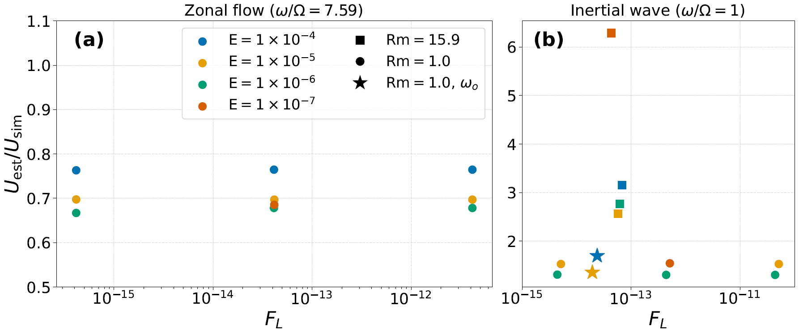

# Europa Lorentz Force Analysis

Code developed for my PhD thesis *"Modelling Magnetic Induction and Lorentz Force-Driven Flows in Europa's Subsurface Ocean"*. The aim is to determine whether zonal flows driven by the Lorentz force in Europa's ocean are large enough to have an effect on the ocean dynamics and are detectable by the Europa Clipper or JUICE spacecraft.

## Scientific background

Europa's ocean is subject to Jupiter's oscillating magnetic field, which induces electrical currents, leading to a Lorentz force. This force has a small time-averaged component that can drive a zonal, westward flow. Because the instantaneous Lorentz force oscillates at the forcing frequency, accurate time-averaging is essential to isolate the small net contribution that drives the flow.

The simulations were run using [MagIC](https://github.com/magic-sph/magic), an open-source spectral code for magnetohydrodynamic simulations in spherical geometry. Documentation can be found [here](https://magic-sph.github.io/postProc.html).

## What I contributed to MagIC

MagIC is orginally used for dynamo simulations, where the spherical shell is the mantle of the planet. Instead, I assume that the spherical shell is the subsurface ocean of Europa. MagIC required several extensions to support the specific purpose for my work:

- **Time-dependent magnetic boundary condition** — modified `src/updateB.f90` to impose an oscillating Jovian background field
- **Lorentz force averaging** — wrote `calc_ave.f90` and `force_average.f90` (included in this repo) to compute running time-averages of the Lorentz force components during the simulation
- **Graphic file output** — extended the G-file output to include the averaged Lorentz force fields, including memory allocation, threading the new arrays through the Fortran codebase, and updating the Python reader to handle the new output

## Files in this repository

### `calc_ave.f90`
A Fortran module implementing a time-averaging object for 3D field quantities. Averaging is performed per radial level using a weighted running average that correctly accounts for variable time steps.

### `force_average.f90`
A module that initialises and finalises the averaging objects for the three Lorentz force components (radial, latitudinal and azimuthal) on the local radial subdomain.

### `lorentz_analysis.py`
Python post-processing script that reads MagIC graphic files (G files), computes volume-weighted RMS and mean values of the Lorentz force using correct spherical quadrature (Gauss-Legendre in colatitude, Clenshaw-Curtis for Chebyshev-Gauss-Lobatto points in radius), and produces one of the figures in de Langen and Wicht (submitted to Earth and Planetary Science Letters, 2026).

### `input.nml`
An example MagIC namelist file showing the input parameters for an inertial wave run at Ek = 1e-6 with Rm = 1. 

### `run.pbs`
SLURM batch script for submitting a MagIC job on the MPS swan cluster.

## Simulations

Approximately 150 simulations were run, varying Ek (1e-7 to 1e-3), Pm (1e-5 to 1e-2), Rm (0.16 to ~1600), and magnetic field amplitude b (5e-8 to 5e-6), covering the relevant parameter space for Lorentz force-driven flow in Europa's ocean. Resolution scales with Ek, ranging from (nr=61, nphi=96) at Ek=1e-3 to (nr=144, nphi=320) at Ek=1e-7.

## Simulation workflow

1. Set up simulation parameters in `input.nml` (example included in this repo)
2. Submit job to the MPS swan cluster via SLURM (`run.pbs`, example included in this repo)
3. MagIC runs and writes output including G files containing the time-averaged Lorentz force
4. Run `lorentz_analysis.py` in the simulation directory to post-process and produce figures

## Computational environment

| | |
|---|---|
| **Cluster** | swan HPC cluster, Max Planck Institute for Solar System Research (MPS), Göttingen |
| **Scheduler** | SLURM |
| **MagIC version** | `v6.3-101-ga84dcaf` |
| **Compiler** | GCC 12.3.0, Fortran 2008 standard |
| **MPI** | Open MPI 4.1.5 |
| **MPI ranks** | 96–144 (depending on resolution) |
| **Python** | 3.x |

## Dependencies

**Fortran:** these files are designed to be compiled as part of MagIC and depend on MagIC internal modules (`precision_mod`, `radial_data`, `truncation`, `constants`). They are not standalone.

**Python:**
- [MagIC Python post-processing library](https://magic-sph.github.io/postProc.html)
- `numpy`, `matplotlib`, `scipy`

## Figure

*Ratio of estimated to simulated zonal velocity as a function of dimensionless Lorentz force magnitude, for the zonal flow regime (a) and inertial wave regime (b), across a range of Ekman numbers. Figure from de Langen and Wicht. (submitted), not for redistribution.*